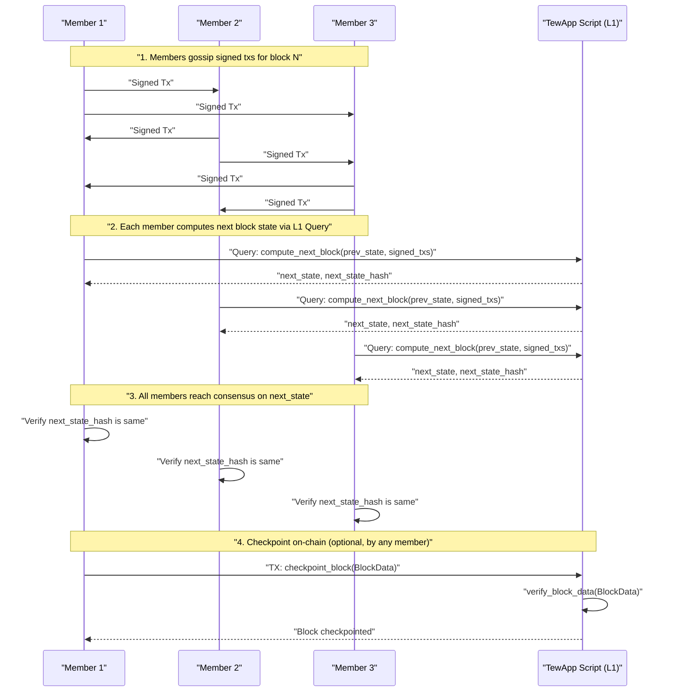

# DysonProtocol L2 – **TewProtocol Specification v0.5**

> **Status:** Draft (supersedes v0.4)
>
> **v0.5 Changes**: This version introduces a significant L2 optimization. Members now sign the hash of the previous state (`prev_state_hash`) instead of the full state object. This dramatically reduces the size of gossiped tx data, improving off-chain communication efficiency.
>
> This version introduces a three-layer architecture: TewProtocol (specification), TewFramework (reference implementation), and TewApp (deployed instances). Each TewApp is a standalone DysonProtocol script that incorporates the framework code along with app-specific logic.

---

## 0 · Scope & Purpose

This document specifies the **TewProtocol**, the consensus communication protocol between Layer-1 (L1) and Layer-2 (L2) for building deterministic Proof-of-Authority applications on the Dyson Protocol blockchain. 

The architecture consists of:
- **TewProtocol** (this document): Defines consensus rules and communication patterns
- **TewFramework**: Reference implementation providing generic L2 infrastructure
- **TewApp**: Specific applications deployed as standalone DysonProtocol scripts
- **TewInstance**: A specific L2 instance created within an app

**Key Design Philosophy**: TewInstances are designed to be **ephemeral** - created when needed, used for their purpose, and cleanly terminated when done. This enables use cases like temporary payment channels, real-time auctions, gaming sessions, and other short-lived activities without permanent infrastructure overhead.

---

## 1 · Architecture Overview

### 1.1 Three-Layer Architecture

| Layer | Purpose | Nature |
|-------|---------|--------|
| **TewProtocol** | L1/L2 consensus specification | Document/Standard |
| **TewFramework** | Generic implementation template | Reference code |
| **TewApp** | Deployed application instance | DysonProtocol script |

### 1.2 Deployment Model

Each TewApp is deployed as a standalone DysonProtocol script that:
1. **Incorporates** the TewFramework code (copied/forked)
2. **Implements** app-specific L1 and L2 logic
3. **Manages** its own TEW instances internally
4. **Exposes** standard entry points for TEW operations

```
DysonProtocol Script (e.g., TEW Thunder a payment channel app)
├── TewFramework code (copied)
│   ├── Block management
│   ├── Tx validation
│   ├── Web dashboard
│   └── Peer discovery
└── App-specific code
    ├── L1 logic (deposits, withdrawals)
    └── L2 logic (transfers, settlements)
```

### 1.3 Key Design Principles

1. **Self-Contained Apps** – Each TewApp is a complete, standalone script
2. **No Central Protocol** – No shared protocol script; each app manages itself
3. **Framework as Template** – TewFramework is copied/modified per app
4. **Script as Source of Truth** – The deployed script contains all logic
5. **Ephemeral Instances** – Tew instances are lightweight and designed for temporary use

### 1.4 Ephemeral Instance Lifecycle

TewInstances follow a natural lifecycle, visualized below. App-specific functions like deposits and withdrawals hook into this standard flow.

```mermaid
sequenceDiagram
    participant U as "User"
    participant L1 as "L1 (TewApp Script)"
    participant L2 as "L2 (Committee)"
    
    Note over U,L2: "Instance Lifecycle"
    
    rect rgb(38, 56, 40)
        Note over U,L1: "1. Instance Creation"
        U->>L1: "create_tew(config)"
        L1->>L1: "Initialize states"
        L1-->>U: "Instance created"
    end
    
    rect rgb(38, 56, 40)
        Note over U,L1: "2. Deposits (App-specific)"
        U->>L1: "process_deposit() + MsgSend"
        L1->>L1: "Lock funds, update L1 state"
        L1->>L1: "Update L2 initial balance"
        L1-->>U: "Deposit confirmed"
    end
    
    rect rgb(38, 56, 40)
        Note over L2: "3. L2 Operations (Many Blocks)"
        loop Blocks 1-N (off-chain)
            L2->>L2: "Create & sign txs"
            L2->>L2: "Gossip signed txs"
            L2->>L1: "Query: compute_next_block()"
            L1-->>L2: "next_state, next_state_hash"
            L2->>L2: "Store block locally"
        end
        Note over L2: "Checkpoint when needed"
        L2->>L2: "Assemble BlockData for block N"
        L2->>L1: "TX: checkpoint_block(BlockData)"
        L1-->>L2: "State saved on-chain"
    end
    
    rect rgb(38, 56, 40)
        Note over U,L1: "4. Withdrawals (App-specific)"
        U->>L2: "request_withdrawal() in L2 tx"
        L2->>L1: "Checkpoint with withdrawal"
        U->>L1: "execute_withdrawal()"
        L1->>U: "Funds sent"
    end
    
    rect rgb(38, 56, 40)
        Note over U,L1: "5. Termination"
        U->>L1: "terminate_instance()"
        L1->>L1: "Process pending operations"
        L1->>U: "Return all balances"
        L1->>L1: "Clean up storage"
    end
```



**Examples of ephemeral use cases:**
- **Payment Channels**: Create for a trading session, close when done
- **Auction Blocks**: Spin up for each auction, terminate after winner determined
- **Voting Sessions**: Create for proposal voting period, archive after decision
- **Gaming Tables**: Create per game session, settle and close when game ends

This ephemeral nature means:
- Low overhead for creating new instances
- No long-term state bloat
- Clean separation between different activities
- Easy to reason about security boundaries

---

## 2 · TewProtocol Specification

### 2.1 Core Protocol Invariants

These rules MUST be followed by all TewApp implementations:

1. **Block Monotonicity** – Blocks progress sequentially without gaps
2. **Committee Consensus** – Valid blocks require participation from all members
3. **State Determinism** – Same inputs produce same state transitions
4. **Timeout Guarantees** – On-chain fallback ensures liveness
5. **State Hash Verifiability** - The hash of a state object must be reproducible on-chain using compact sorted JSON serialization.

### 2.2 Storage Schema

Each TewApp MUST use this storage layout for TewInstances:

```
Storage Key Pattern (within app's namespace):
tew/{instance_id}/l1/state                    # L1 state (JSON)
tew/{instance_id}/l1/meta                     # Instance metadata
tew/{instance_id}/l2/blocks/{block:010d}      # L2 block commits (Full BlockData)
tew/{instance_id}/l2/latest_block_hash        # Hash of the latest L2 state
tew/{instance_id}/balances/{denom}            # Escrowed funds (If applicable)
tew/{instance_id}/txs/{block}/{member}/{hash} # Tx submissions (On-chain fallback)
```

### 2.3 Data Structures (v0.5 Update)

This section defines the core data structures used in the TewProtocol.

#### 2.3.1 `L2 State` (`l2_state`)

The `L2 State` is the complete JSON representation of an instance's off-chain data at a specific block height. Its hash is used for consensus.

- **`meta`**: (object) Contains metadata about the state.
  - **`instance_id`**: (string) The unique identifier for the TewInstance.
  - **`block_height`**: (integer) The block number this state represents.
  - **`committee`**: (array of strings) A list of the member addresses.
- **`data`**: (object) Contains application-specific state. The structure of this object is defined by the TewApp.
- **`tx_results`**: (object) A map of member addresses to the results of their transactions from the *previous* block. This allows for simple confirmation of tx execution.

**Example `L2 State`:**
```json
// Example L2 State Object
{
  "meta": {
    "instance_id": "channel_001",
    "block_height": 4,
    "committee": ["dys1alice...", "dys1bob..."]
  },
  "data": {
    // App-specific state data (e.g., balances, positions)
    "balances": {
      "dys1alice...": {"udys": 800000},
      "dys1bob...": {"udys": 700000}
    }
  },
  "tx_results": {
    // Results from the execution of the previous block's txs
    "dys1alice...": {"success": true, "result": null},
    "dys1bob...": {"success": false, "error": "Insufficient balance"}
  }
}
```

#### 2.3.2 `Tx Data`

This is the minimal JSON data structure that a committee member signs for each block. It commits to the previous state via a hash. The `data` field of the `MsgArbitraryData` in a `Signed Tx` contains a JSON string of this object.

- **`instance_id`**: (string) The TewInstance ID.
- **`l2_block_height`**: (integer) The L2 block number this tx is for.
- **`prev_state_hash`**: (string) The SHA256 hash of the bencode representation of the `L2 State` from the previous block (block N-1).
- **`msgs`**: (array of strings) A list of Dyslang code snippets to be executed in the L2 sandbox.

**Example `Tx Data`:**
```json
// The content that gets signed by a member for their tx
{
  "instance_id": "channel_001",
  "l2_block_height": 5,
  "prev_state_hash": "sha256:abc123...", 
  "msgs": ["transfer_to('dys1bob...', 100000)"]
}
```

#### 2.3.3 `Signed Tx`

A `Signed Tx` is a standard Dyson Protocol transaction (`core.Tx`) containing a `MsgArbitraryData` message. This is the object gossiped between L2 nodes.

**Structure of a Gossiped `Signed Tx`:**
```json
// Gossiped Signed Tx
{
  "body": {
    "messages": [{
      "@type": "/dysonprotocol.script.v1.MsgArbitraryData",
      "signer": "dys1alice...",
      "data": "{... JSON string of Tx Data from 2.3.2 ...}",
      "app_domain": "tew/tx",
      "metadata": "{}"
    }]
  },
  "auth_info": { ... },
  "signatures": ["..."]
}
```

#### 2.3.4 `Signed Txs` (`signed_txs`)

The `signed_txs` object is a dictionary that aggregates all the `Signed Tx` objects for a given block from all committee members. The keys are the addresses of the members, and the values are their corresponding `Signed Tx` objects. This structure is passed to `compute_next_block`.

**Example `signed_txs`:**
```json
// signed_txs object for block N
{
  "dys1alice...": { /* Signed Tx from Alice for block N */ },
  "dys1bob...":   { /* Signed Tx from Bob for block N */ }
}
```

#### 2.3.5 `BlockData` (`block_data`)

When a block is checkpointed on-chain, this comprehensive `BlockData` object is submitted. It contains everything needed to independently verify the state transition from `prev_state` to `next_state`.

- **`prev_state`**: (object) The full `L2 State` object from the previous block (N-1).
- **`prev_state_hash`**: (string) The hash of `prev_state`.
- **`signed_txs`**: (object) The `Signed Txs` object for the current block (N), as defined in 2.3.4.
- **`next_state`**: (object) The full `L2 State` object for the current block (N), which is the result of applying `signed_txs` to `prev_state`.
- **`next_state_hash`**: (string) The hash of `next_state`.

**Example `BlockData` (Checkpoint Object):**
```json
// Checkpoint Object
{
  "prev_state": { /* Full L2 State object from block N-1 */ },
  "prev_state_hash": "sha256:abc123...",
  "signed_txs": {
    "dys1alice...": { /* Signed Tx for block N */ },
    "dys1bob...":   { /* Signed Tx for block N */ }
  },
  "next_state": { /* Full L2 State object for block N */ },
  "next_state_hash": "sha256:def456..."
}
```

### 2.4 Function Execution and Scoping

The protocol defines clear rules for how functions are defined and executed to ensure security and clarity. L1 functions are exposed directly as public entry points on the script, while L2 logic is executed within a safe, sandboxed environment.

#### 2.4.1 L1 Function Execution

- **Direct API**: L1 state changes are triggered by calling a script's public functions directly (e.g., `process_deposit`, `checkpoint_block`). There is no generic dispatcher function.
- **Context**: These functions execute within a transaction context and can modify state.

#### 2.4.2 L2 Sandboxed Execution

- **Code as Data**: The `msgs` array in an L2 transaction contains strings of Dyslang code.
- **Sandbox**: The TewFramework is responsible for executing these strings in a restricted, sandboxed environment for each block. This prevents L2 transactions from accessing unauthorized functions or modifying state in unintended ways.
- **Mechanism**: The reference implementation uses Dyslang's `dys_eval()` function, providing it with a limited namespace containing only the necessary state objects and safe, app-defined L2 functions (e.g., `transfer_to`, `request_withdrawal`).

### 2.5 Required Public Entry Points

Each TewApp script exposes public functions that serve as the main API for both L1 and L2 interactions.

```python
def create_tew(config: dict) -> dict:
    """Creates a new TewInstance. Must be called in an L1 transaction."""
    pass

# Additional L1 functions specific to the app would also be public.
# Example for a payment channel app:
def process_deposit(instance_id: str):
    """Handles an L1 deposit into the instance."""
    pass

def execute_withdrawal(instance_id: str, user_address: str):
    """Handles an L1 withdrawal from the instance."""
    pass
    
def submit_tx(instance_id: str, signed_tx: str) -> dict:
    """Submits a tx for the next block (on-chain fallback). L1 context."""
    pass

def checkpoint_block(instance_id: str, block_data: dict) -> dict:
    """
    Fast-forwards the state via an off-chain agreed checkpoint. L1 context.
    Validates the entire BlockData object.
    """
    pass

def signal_force_onchain(instance_id: str, block: int) -> dict:
    """Signals intent to force on-chain execution. L1 context."""
    pass

def progress_block(instance_id: str) -> dict:
    """Executes a block on-chain using submitted txs (fallback). L1 context."""
    pass

def terminate_instance(instance_id: str) -> dict:
    """Cleanly terminates an instance. L1 context."""
    pass

def wsgi(environ, start_response):
    """Web dashboard (read-only). Executed in a query context."""
    pass

# L2 nodes use this function to compute the next state off-chain.
def compute_next_block(prev_state: dict, signed_txs: dict) -> dict:
    """
    Called by L2 nodes via read-only RunScript queries.
    Returns the new state without modifying the blockchain.
    """
    pass
```

### 2.6 L2 Execution Model (RunScript Queries)

The L2 execution model is where off-chain nodes deterministically compute the next state. The following diagram illustrates this consensus flow.



**Key Principles:**
1. **Local State**: Each L2 node holds the full `L2 State` from the last known block.
2. **Hashing**: Each node computes the `prev_state_hash` of its current state.
3. **Signing & Gossiping**: Nodes create and sign `Tx Data` (containing `msgs` as code strings) and gossip the lightweight `Signed Tx`.
4. **Verification**: Upon receiving txs from peers, nodes verify that the `prev_state_hash` in each tx matches their own calculated hash.
5. **Deterministic Execution**: Once all valid txs are collected, nodes use `dysond query script run` to execute the public `compute_next_block` function, which internally uses the sandboxed `dys_eval` to process messages and compute the `next_state`.

**Example L2 Query for State Transition:**
```bash
# L2 node queries the script to compute the next block's state
dysond query script run \
  --executor-address dys1committee_member... \
  --script-address dys1thunder... \
  --function-name compute_next_block \
  --args '[{
    "prev_state": {...}, 
    "signed_txs": {...}
  }]'
# The query returns the complete 'next_state' object
```

**Benefits of Hash-Based Signing:**
- **Efficiency**: Gossiped data is minimal, consisting only of the signed tx, not the entire state.
- **Security**: The commitment to the previous state is maintained via the hash.
- **Auditability**: The full `BlockData` object, which is checkpointed on-chain, still contains the complete `prev_state` and `next_state`, allowing for full, independent verification of the transition.

---

## 3 · TewFramework Reference Implementation

The framework implementation MUST provide utilities for deterministic state hashing.

### 3.1 Framework Components

```python
# tew_framework.py - v0.5 Reference implementation template

# Core Tew management
def create_tew(config): ...
def checkpoint_block(instance_id, block_data): ...
# ... other required functions

# Generic utilities
def validate_tx_signature(signed_tx): ...
def get_state_hash(state: dict) -> str:
    """
    Deterministically hashes an L2 state object.
    MUST produce the same hash on-chain and off-chain.
    Uses compact sorted JSON for deterministic serialization.
    """
    # ... implementation ...

def verify_block_data(block_data: dict) -> bool:
    """
    Verifies a full BlockData object on-chain.
    1. Hashes `prev_state` using compact sorted JSON and checks it matches `prev_state_hash`.
    2. Validates signatures on all `signed_txs`.
    3. Verifies that the `prev_state_hash` in each tx is correct.
    4. Re-runs the L2 logic with `prev_state` and txs to re-compute the `next_state`.
    5. Hashes the computed state using compact sorted JSON and checks it matches `next_state_hash`.
    """
    # ... implementation ...

# App integration points (to be overridden)
def app_l2_apply_txs(l2_state: dict, txs: dict) -> dict:
    """
    Override with app-specific L2 logic to apply txs to a state.
    This function orchestrates the sandboxed execution of messages.
    """
    raise NotImplementedError

# L2 query entry point (called via RunScript)
def compute_next_block(prev_state: dict, signed_txs: dict) -> dict:
    """
    Called by L2 nodes via read-only RunScript queries.
    Returns the new state without modifying the blockchain.
    """
    # 1. Verify signatures and prev_state_hash in txs
    # 2. Apply txs to prev_state using app_l2_apply_txs which provides a sandbox
    new_state = prev_state.copy()
    new_state['tx_results'] = app_l2_apply_txs(new_state, signed_txs)
    new_state['meta']['block'] += 1
    # 3. Return the complete new_state object
    return {
        "next_state": new_state,
        "next_state_hash": get_state_hash(new_state)
    }

# ... other framework functions (web dashboard, peer discovery, etc.) ...
```

---

## Appendix A: Core Dyslang Primitives

This section documents the core Dyslang functions and queries required to implement the TewProtocol.

### A.1 State Storage

Scripts store their state in a key-value store owned by the script itself.

**Writing to Storage (L1 Context):**
State is written using a `MsgStorageSet` message. This can only be done in an L1 transaction.

```python
import json
from dys import _msg

def save_data(owner: str, index: str, data: dict):
    _msg({
        "@type": "/dysonprotocol.storage.v1.MsgStorageSet",
        "owner": owner,
        "index": index,
        "data": json.dumps(data)
    })
```

**Reading from Storage (L1 or L2 Context):**
State is read using a `QueryStorageGetRequest` query.

```python
import json
from dys import _query

def load_data(owner: str, index: str):
    try:
        response = _query({
            "@type": "/dysonprotocol.storage.v1.QueryStorageGetRequest",
            "owner": owner,
            "index": index
        })
        return json.loads(response["entry"]["data"])
    except:
        return None
```

### A.2 Signature Verification

ADR-036 signed transactions can be verified on-chain using `QueryVerifyTxRequest`.

```python
import json
from dys import _query

def verify_tx(signed_tx: dict) -> bool:
    result = _query({
        "@type": "/dysonprotocol.script.v1.QueryVerifyTxRequest",
        "tx_json": json.dumps(signed_tx)
    })
    # A code of 0 indicates success.
    return result.get("code") == 0
```

### A.3 Accessing Block Information

Details about the current or historical L1 blocks can be retrieved using a `QueryGetBlockRequest`. This allows querying for specific block heights, making it highly flexible.

```python
from dys import _query
import json

def query_block(height=None):
    """
    Queries for block information at a specific height.
    If height is None, it fetches the latest block.
    """
    result = _query({
        "@type": "/dysonprotocol.script.v1.QueryGetBlockRequest"
    })
    # The result from _query is a dict, but we return a JSON string
    # for consistent parsing by consumers.
    return json.dumps(result)

# Example usage to get the latest block:
latest_block_json = query_block()

# Example usage to get a specific block:
specific_block_json = query_block(height=12345)
```

### A.4 Script Execution

**L1 Transaction (`exec`):**
To execute a function that modifies state, a user sends a transaction.

```bash
dysond tx script exec \\
  --script-address dys1... \\
  --function-name process_deposit \\
  --args '["instance_001"]' \\
  --from <user_key>
```

**L2 Query (`run`):**
To execute a function in a read-only context (without modifying state), a user or L2 node sends a query. This is the primary mechanism for off-chain computation.

```bash
dysond query script run \\
  --script-address dys1... \\
  --function-name compute_next_block \\
  --args '[{...prev_state...}, {...signed_txs...}]'
```

---
*End of TewProtocol Specification v0.5* 