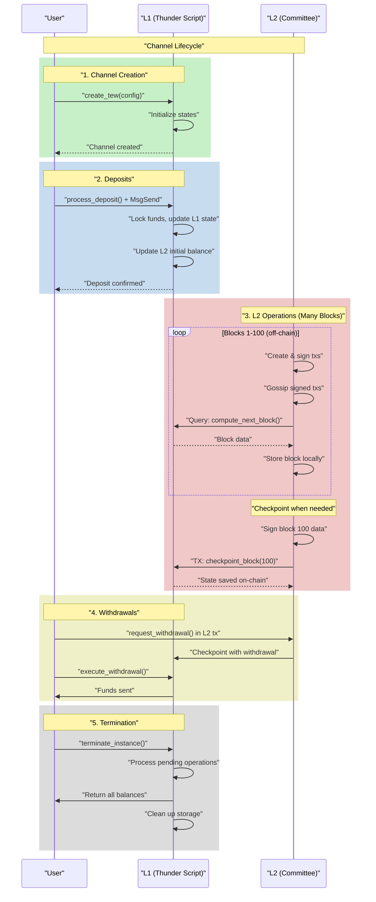
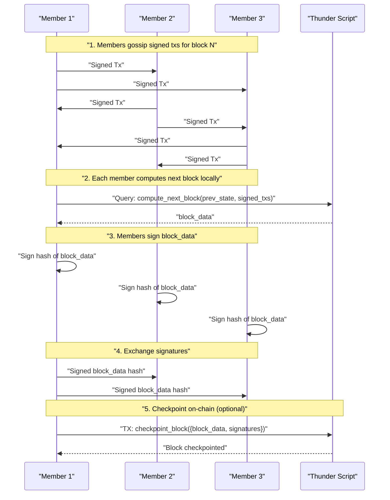

# TEW Thunder - N-Member Payment Channel Specification

> **Status:** Draft  
> **Version:** 0.5  
> **Based on:** TEW Protocol v0.5  
> **Changes:** Aligned with TEW Protocol v0.5, replacing round/slot terminology with block/tx and updating data structures.

## 1. Overview

TEW Thunder is an N-member payment channel application implemented as a standalone DysonProtocol script incorporating the TEW Framework. It exemplifies the ephemeral TEW instance pattern - channels are created for specific payment sessions and cleanly terminated when complete.

The specification now includes a consensus flow that provides strong security guarantees through cryptographic validation of all operations and complete consensus on block data.

Key capabilities:
- Deposit funds on-chain into temporary payment channels
- Perform unlimited off-chain transfers between members with instant finality  
- Withdraw funds back to the blockchain when needed
- Clean termination with automatic settlement when done
- **NEW**: Improved consensus with off-chain tx validation and deterministic block computation

### 1.1 Key Features

- **Multi-party channels**: Support for N members (not just 2-party)
- **Instant transfers**: L2 transfers happen in blocks without on-chain fees
- **Atomic deposits/withdrawals**: Funds are locked on L1 and tracked consistently
- **Cryptographic consensus**: All operations are signed and validated before execution
- **Complete audit trail**: Block data includes all inputs, outputs, and computation results
- **Pure L2 operation**: No on-chain storage needed for temporary tx data
- **Capital efficient**: Only requires on-chain transactions for deposits/withdrawals

### 1.2 Channel Lifecycle Overview



## 2. Architecture

### 2.1 Script Structure

TEW Thunder is deployed as a single DysonProtocol script containing:

```
tew_thunder.py
├── TEW Framework (incorporated)
│   ├── create_tew()
│   ├── checkpoint_block()
│   ├── terminate_instance()
│   └── Web dashboard
├── Consensus Functions
│   ├── compute_next_block()
│   └── verify_block_signatures()
└── Thunder-specific logic
    ├── L1 functions
    │   ├── process_deposit()
    │   └── execute_withdrawal()
    └── L2 logic
        ├── transfer_to()
        └── request_withdrawal()
```

### 2.2 State Model

**L1 State Structure:**
```json
{
  "deposits": {
    "dys1...alice": {"udys": 1000000},
    "dys1...bob": {"udys": 500000}
  },
  "balances": {
    "dys1...alice": {"udys": 1000000},
    "dys1...bob": {"udys": 500000}
  },
  "total_locked": 1500000,
  "withdrawals": {},
  "nonce": 42
}
```

**L2 State Structure (`l2_state`):**
```json
{
  "meta": {
    "instance_id": "channel_001",
    "block_height": 5,
    "committee": ["dys1...alice...", "dys1...bob..."]
  },
  "data": {
    "balances": {
      "dys1...alice": {"udys": 800000},
      "dys1...bob": {"udys": 700000}
    },
    "transfers": [
      {
        "from": "dys1...alice",
        "to": "dys1...bob",
        "amount": 200000,
        "block": 10
      }
    ],
    "withdrawal_requests": {
      "dys1...alice": {
        "amount": 200000,
        "requested_block": 15
      }
    }
  },
  "tx_results": {}
}
```

### 2.3 Consensus Data Structures

**`Tx Data` Format:**
This is the content signed by a member for their L2 transaction.
```json
{
  "instance_id": "channel_001",
  "l2_block_height": 5,
  "prev_state_hash": "sha256:...",
  "msgs": ["transfer_to('dys1bob...', 100000)"]
}
```

**`Signed Tx` Format:**
A standard Dyson Protocol `core.Tx` wrapping the `Tx Data`.
```json
{
  "body": {
    "messages": [{
      "@type": "/dysonprotocol.script.v1.MsgArbitraryData",
      "signer": "dys1alice...",
      "data": "{... JSON string of Tx Data ...}",
      "app_domain": "tew/tx",
      "metadata": "{}"
    }]
  },
  "auth_info": {...},
  "signatures": [...]
}
```

**`BlockData` Format:**
The comprehensive object produced by `compute_next_block`.
```json
{
  "meta": {
    "instance_id": "channel_001",
    "block_height": 5,
    "committee": ["dys1alice...", "dys1bob...", "dys1charlie..."],
    "l1_block_header": {/* l1 block header */}
  },
  "prev_state": {/* previous L2 state */},
  "prev_state_hash": "sha256:...",
  "signed_txs": {
    "dys1alice...": {/* signed tx */},
    "dys1bob...": {/* signed tx */},
    "dys1charlie...": {/* signed tx */}
  },
  "next_state": {/* computed next L2 state, including tx_results */}
}
```

**`Checkpoint` Format:**
The object submitted to `checkpoint_block`, containing the agreed-upon block and signatures on that block's data.
```json
{
  "block_data": {/* complete BlockData as above */},
  "signatures": {
    "dys1alice...": {/* signed tx from alice with hash of block_data */},
    "dys1bob...":   {/* signed tx from bob with hash of block_data */}
  }
}
```

## 3. User Flows

### 3.1 Deposit Flow

1. User calls Thunder script directly with funds:
   ```bash
   dysond tx script exec \
     --script-address dys1thunder... \
     --function-name process_deposit \
     --args '["channel_001"]' \
     --attached-message '{"@type":"/cosmos.bank.v1beta1.MsgSend",...}' \
     --from alice
   ```

2. Thunder script processes deposit:
   - Validates sender is committee member
   - Checks minimum deposit requirements
   - Updates L1 state with deposit tracking
   - Updates L2 initial balance
   - Locks funds in script escrow

### 3.2 Transfer Flow (L2) - Consensus

The consensus flow provides strong security guarantees. **Importantly, many blocks can be processed off-chain before a checkpoint is needed**, making the system highly efficient.

#### Typical L2 Operation Pattern

1. **Blocks 1-100**: Processed entirely off-chain
   - Members exchange signed txs
   - Each block is computed locally
   - Block data is stored off-chain
   
2. **Block 101**: Checkpoint triggered
   - Due to withdrawal request, or
   - Periodic checkpoint for safety, or
   - Member-initiated checkpoint
   
3. **Checkpoint includes**: Blocks 1-101 cumulative state
   - Only the final state is checkpointed
   - Intermediate blocks don't touch the chain

#### Detailed Consensus Flow (Per Block)



Detailed steps:

1. **Member creates and signs L2 transaction**:
   - Creates `Tx Data` with transfer logic: `msgs: ["transfer_to('dys1bob...', 100000)"]`
   - Wraps in `Signed Tx` format
   - Includes instance_id, block number, and prev_state_hash

2. **Off-chain tx gossip**:
   - Members share `Signed Tx` objects via a P2P network.

3. **Local block computation**:
   - Each member computes the next block deterministically:
   ```bash
   dysond query script run \
     --script-address dys1thunder... \
     --function-name compute_next_block \
     --args '["channel_001", 5, {signed_txs}]'
   ```

4. **Consensus on block data**:
   - Each member signs the hash of the complete `BlockData` object.
   - Members exchange these signatures off-chain.

5. **On-chain checkpoint** (when needed):
   - Any member submits the agreed block data and signatures:
   ```bash
   dysond tx script exec \
     --script-address dys1thunder... \
     --function-name checkpoint_block \
     --args '["channel_001", 101, {
       "block_data": {...},
       "signatures": {...}
     }]' \
     --from alice
   ```

**Important Note on Checkpoint Frequency:**
- Steps 1-4 happen for EVERY block off-chain
- Step 5 (checkpoint) happens only when needed

### 3.3 Withdrawal Flow

1. Member requests withdrawal in an L2 tx:
   ```python
   request_withdrawal(50000)
   ```

2. Committee includes withdrawal in checkpoint

3. User executes withdrawal on-chain:
   ```bash
   dysond tx script exec \
     --script-address dys1thunder... \
     --function-name execute_withdrawal \
     --args '["channel_001", "dys1alice..."]' \
     --from alice
   ```

4. Thunder validates and sends funds

### 3.4 Channel Termination

1. Any committee member initiates termination:
   ```bash
   dysond tx script exec \
     --script-address dys1thunder... \
     --function-name terminate_instance \
     --args '["channel_001"]' \
     --from alice
   ```

2. Thunder automatically:
   - Processes pending withdrawals
   - Returns all balances to depositors
   - Marks instance as terminated
   - Cleans up storage

## 4. Security Model

### 4.1 Fund Safety

- **Deposit Safety**: Funds locked in script escrow until withdrawn
- **Balance Integrity**: L1 deposits are authoritative; L2 cannot exceed L1
- **Withdrawal Authorization**: Only L2-approved withdrawals can execute

### 4.2 Consensus Requirements - Improved Flow

The improved consensus flow provides:

- **Slot Validation**: Cryptographic signatures verified before processing
- **Deterministic Computation**: All honest members compute identical states
- **Complete Consensus**: ALL committee members must sign round data
- **Atomic Updates**: Round data signed as complete unit
- **Full Audit Trail**: Round data preserves all inputs and outputs

### 4.3 Attack Vectors & Mitigations

| Attack | Description | Mitigation |
|--------|-------------|------------|
| **Double Spend** | Transfer more than balance | L2 logic enforces balance checks |
| **Slot Replay** | Reuse old slot | Round numbers prevent replay |
| **State Tampering** | Modify round data | Requires all signatures on exact data |
| **Deposit Theft** | Claim another's deposit | Deposits tied to sender address |
| **Consensus Block** | Refuse to sign | Timeout + force on-chain fallback |

## 5. Implementation Requirements

### 5.1 Thunder Script Functions

**Framework Core:**
- `create_tew(config)` - Initialize payment channel
- `terminate_instance(instance_id)` - Close channel

**Consensus Functions:**
- `compute_next_block(instance_id, block_height, signed_txs)` - Compute block data (query)
- `checkpoint_block(instance_id, block_height, checkpoint)` - Save consensus
- `verify_block_signatures(block_data_hash, sigs, committee)` - Verify consensus

**Thunder L1 Functions:**
- `process_deposit(instance_id)` - Handle incoming deposits
- `execute_withdrawal(instance_id, address)` - Process withdrawals

**Thunder L2 Functions:**
- `transfer_to(recipient, amount)` - Transfer between members
- `request_withdrawal(amount)` - Queue withdrawal request

**Legacy/Fallback:**
- `submit_tx()` - On-chain tx submission (for fallback)
- `progress_block()` - Force on-chain execution
- `signal_force_onchain()` - Initiate timeout

### 5.2 Migration Path

The implementation supports both consensus models:

1. **Phase 1**: Deploy with new functions.
2. **Phase 2**: L2 nodes adopt new flow.
3. **Phase 3**: Deprecate on-chain tx storage.
4. **Phase 4**: Remove legacy code paths.

### 5.3 Tx Logic Examples

**Transfer Tx:**
```python
# Transfer 100,000 udys to Bob
msgs: ["transfer_to('dys1bob...', 100000)"]
```

**Multi-operation Tx:**
```python
# Transfer to multiple recipients and request withdrawal
msgs: [
  "transfer_to('dys1bob...', 50000)",
  "transfer_to('dys1charlie...', 30000)",
  "request_withdrawal(20000)"
]
```

## 6. Testing Strategy

### 6.1 Unit Tests
- Signature verification
- Balance calculations
- State transitions

### 6.2 Integration Tests  
- Full deposit → transfer → withdrawal flow
- Consensus with all members signing
- Consensus with missing signatures
- Timeout and force on-chain

### 6.3 Security Tests
- Double spend attempts
- Replay attacks
- Malformed slot data
- Byzantine committee members

## 7. Deployment Guide

### 7.1 Deploy Thunder Script

```bash
# Deploy the script
dysond tx script create-new-script \
  --code-path ./tew_thunder.py \
  --from deployer
# Returns: dys1thunder...
```

### 7.2 Create Payment Channel

```bash
dysond tx script exec \
  --script-address dys1thunder... \
  --function-name create_tew \
  --args '[{
    "instance_id": "channel_001",
    "committee": ["dys1alice...", "dys1bob...", "dys1charlie..."],
    "timeout": 300,
    "app_config": {
      "min_deposit": 1000000
    }
  }]' \
  --from alice
```

### 7.3 Monitor Channel

Access web dashboard:
```
http://dys1thunder.../
```

Query channel info:
```bash
dysond query script run \
  --script-address dys1thunder... \
  --function-name get_instance_info \
  --args '["channel_001"]'
```

## 8. Future Enhancements

### 8.1 Advanced Features
- **Cross-channel routing**: Multi-hop payments
- **Multi-asset support**: Beyond just DYS token
- **Privacy features**: Zero-knowledge balance proofs
- **Watchtowers**: Third-party monitoring

### 8.2 Optimizations
- **State compression**: Merkle trees for large channels
- **Batch operations**: Multiple transfers per slot
- **Parallel channels**: Multiple channels per committee

## 9. References

- [TEW Protocol v0.5 Specification](../tew-spec-0.5.md)
- [TEW Thunder Implementation](./tew_thunder.py)

---

*End of TEW Thunder Specification v0.5*